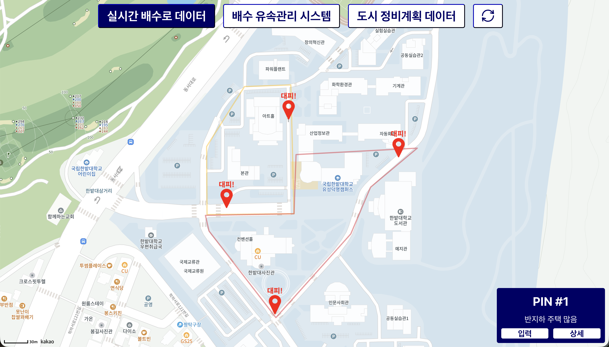
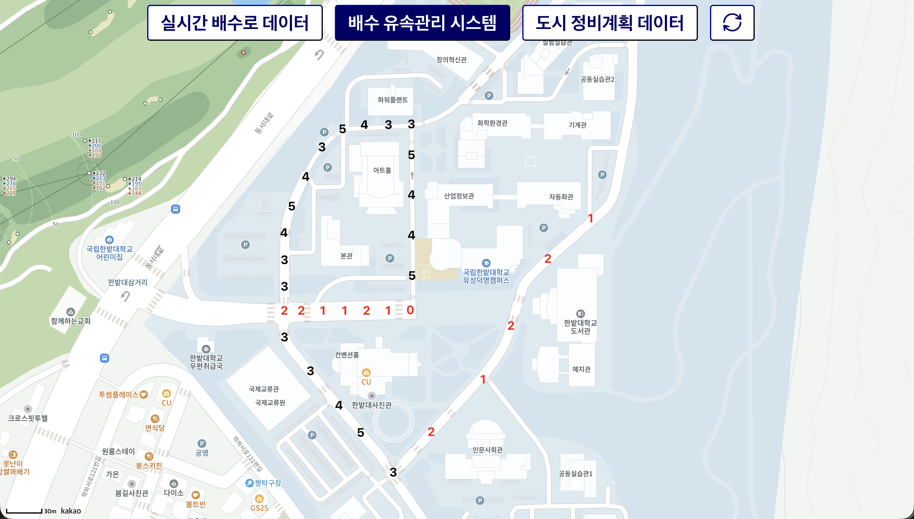
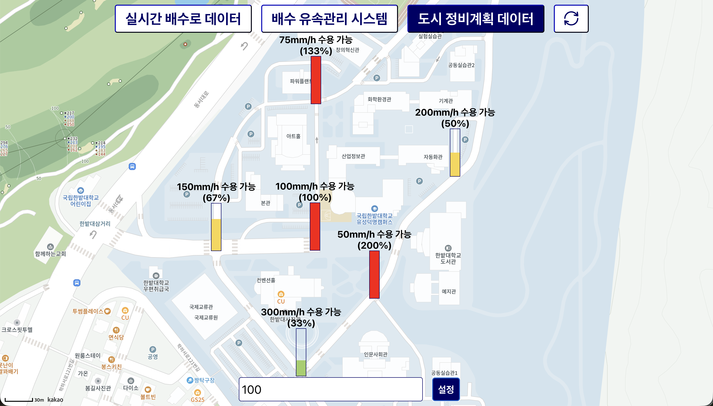

# 한국형 폭우 재난구조 시스템 Baekwoon

## 소개
- 유속 센서와 유량 센서를 폭우 피해가 발생될 것으로 예상되는 지점에 설치함
- 웹에서 해당 센서의 값을 토대로 실시간 지역의 폭우 피해 위험도를 시각화함
- 현재 유속의 정도를 5단계로 하고 각 지점마다 유속의 정도를 지도 위에 시각화함
- 해당 지점별로 최대 수용 가능한 유량을 설정하고, 강수량에 따라 각 지점 별 수용 가능 상태를 시각화함

## 기술 스택
- 프론트엔드 : React
- 백엔드 : FastAPI
- 데이터베이스 : PostgreSQL
- 하드웨어 : Arduino, 유속 센서, 유량 센서

## 작동 과정
- 서버 컴퓨터에서 계속해서 유속 센서와 유량 센서값을 읽어와 DB에 전송함
- 프론트엔드에서 DB에 저장된 센서값을 주기적으로 읽어와 지도 위에 시각화함

## 결과

